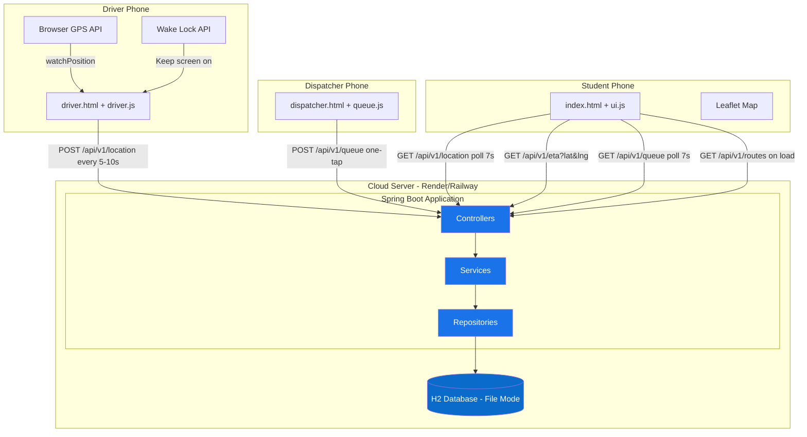
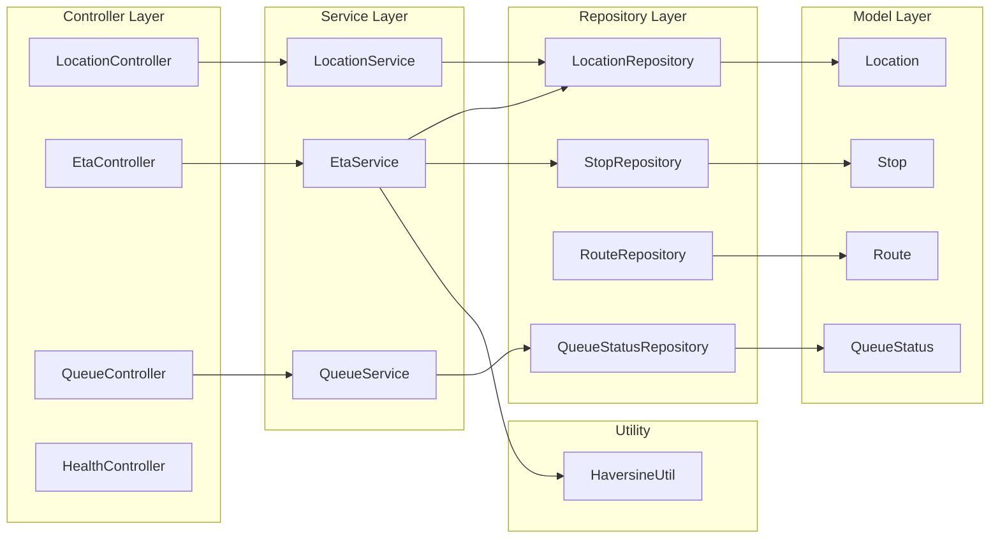
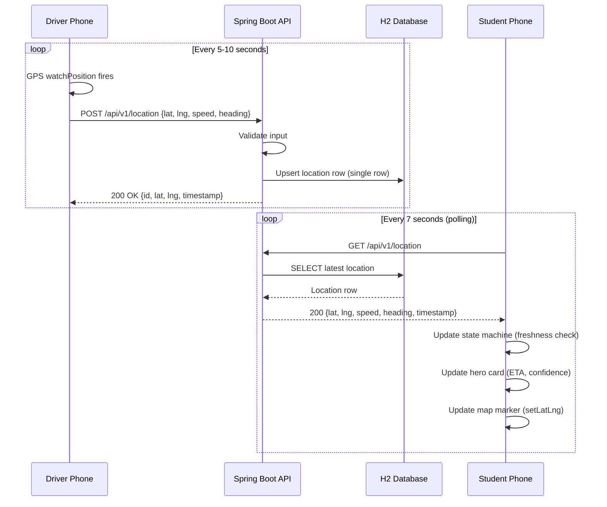
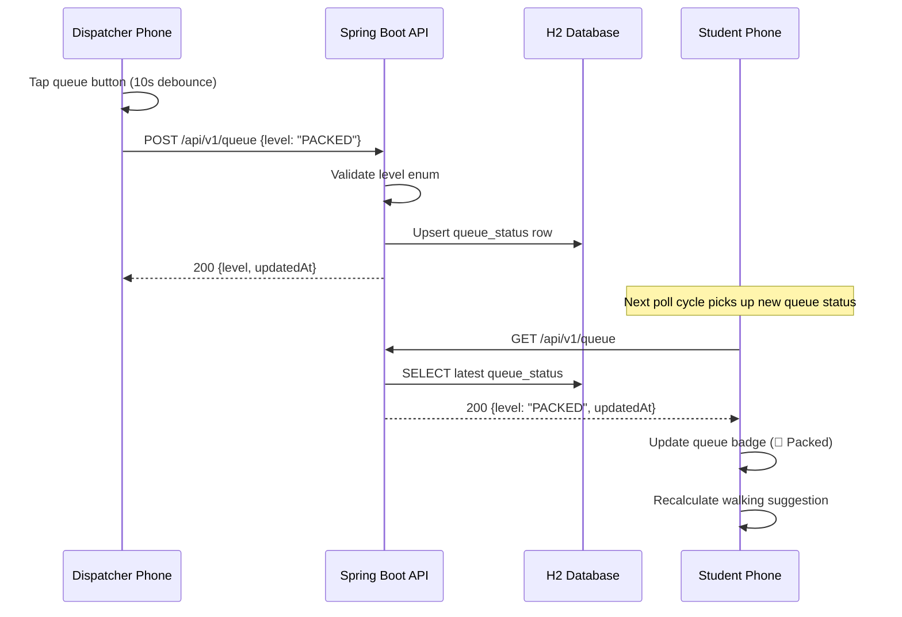
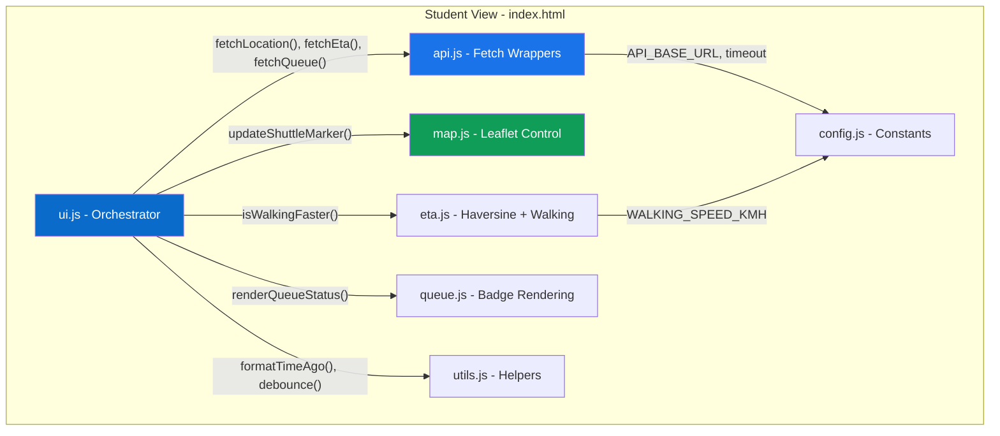
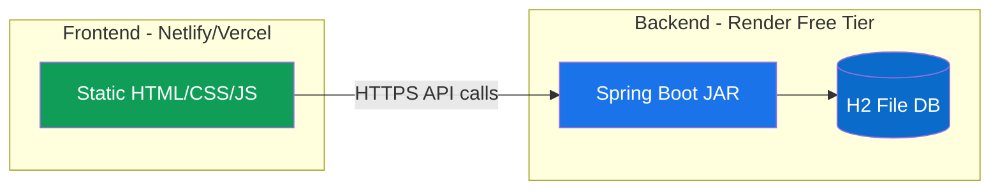

# System Architecture — Uni-Track

> Phase 2 Deliverable | Architecture & Design Document

---

## 1. High-Level System Architecture

---

## 2. MVC Architecture (Backend)

### Why MVC?
- **Spec mandate:** The execution plan explicitly requires MVC separation.
- **Testability:** Services can be unit-tested independently of HTTP.
- **Clarity:** Each layer has one responsibility — controllers validate input, services implement logic, repositories handle data.

---

## 3. Data Flow Diagrams

### Driver → Backend → Student (Location Flow)

### Dispatcher → Backend → Student (Queue Flow)

---

## 4. Frontend Module Architecture

**`ui.js` is the orchestrator.** It owns the polling loop (`setInterval`), calls `api.js` for data, passes results to `map.js`, `eta.js`, and `queue.js` for rendering, and manages the network state machine. No other module starts its own timers or fetches.

---

## 5. Deployment Architecture

### Deployment decisions:

| Aspect | Choice | Rationale |
|---|---|---|
| Frontend host | Netlify or Vercel | Free tier, automatic HTTPS, CDN for fast load on Nigerian networks |
| Backend host | Render free tier | Free, supports Java, auto-deploys from Git, HTTPS included |
| Database | H2 file mode on Render | Render's free tier includes ephemeral disk — H2 file persists within a deploy cycle. Data seeds on startup regardless |
| CORS | Allow frontend origin | Configured in `CorsConfig.java` |

> **Note on Render free tier:** The server spins down after 15 min of inactivity, causing a ~30s cold start on first request. This is acceptable for an MVP field test. The student UI's state machine will show "Updating..." during the cold start, then transition to NORMAL once the first response arrives.

---

## 6. Technology Stack Summary

| Layer | Technology | Version | Purpose |
|---|---|---|---|
| Language | Java | 25 (LTS) | Backend logic |
| Framework | Spring Boot | 3.x (latest) | REST API, DI, data layer |
| Database | H2 | Embedded | Lightweight, zero-config |
| ORM | Spring Data JPA | Via Spring Boot | Repository pattern |
| Validation | Jakarta Validation | Via Spring Boot | `@Valid` input checking |
| Build tool | Maven | 3.9+ | Dependency management, JAR packaging |
| Frontend | HTML5 + CSS3 + JS | ES6+ | No framework, vanilla |
| CSS framework | Bootstrap 5 | 5.3.x CDN | Responsive grid, components |
| Map | Leaflet.js | 1.9.x CDN | Interactive map (swappable to Google Maps later) |
| Tiles | OpenStreetMap | — | Free, no API key needed |
