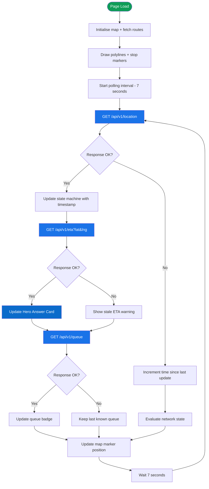
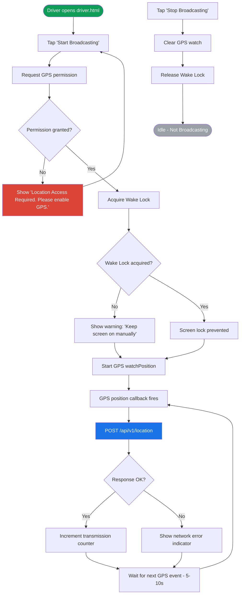
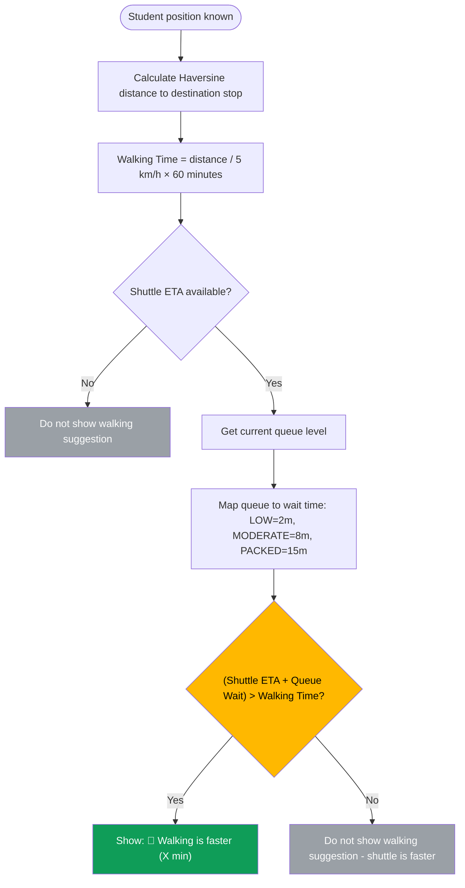
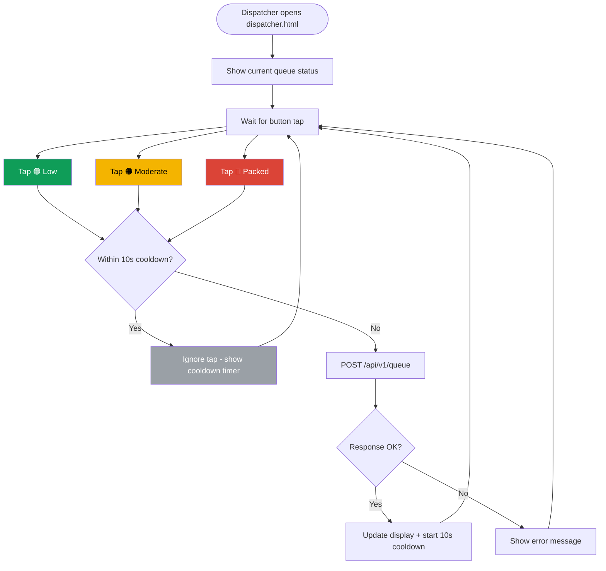
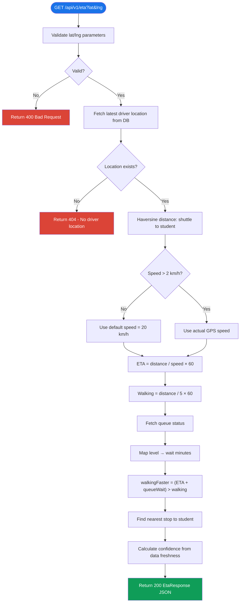

# Flowcharts & State Diagrams — Uni-Track

> Phase 2 Deliverable | Visual Logic Documentation

---

## 1. Student Polling Loop



---

## 2. Network State Machine

```mermaid
stateDiagram-v2
    [*] --> NORMAL

    NORMAL --> WARNING : 15s without update
    WARNING --> STALE : 30s without update
    STALE --> DISCONNECTED : 60s without update

    NORMAL --> NORMAL : New data received
    WARNING --> NORMAL : New data received
    STALE --> NORMAL : New data received
    DISCONNECTED --> NORMAL : New data received

    state NORMAL {
        direction LR
        note right of NORMAL
            Green ETA badge
            Full marker opacity
            Fresh data indicator
        end note
    }

    state WARNING {
        direction LR
        note right of WARNING
            Grey ETA badge
            "Updating..." label
            Full marker opacity
        end note
    }

    state STALE {
        direction LR
        note right of STALE
            Warning overlay
            "Last updated X sec ago"
            75% marker opacity
        end note
    }

    state DISCONNECTED {
        direction LR
        note right of DISCONNECTED
            "Location unavailable"
            50% marker opacity
            Warning badge
        end note
    }
```

### State transition logic (JavaScript):

```javascript
function getNetworkState(lastUpdateTimestamp) {
    const elapsed = (Date.now() - lastUpdateTimestamp) / 1000; // seconds

    if (elapsed <= 15) return 'NORMAL';
    if (elapsed <= 30) return 'WARNING';
    if (elapsed <= 60) return 'STALE';
    return 'DISCONNECTED';
}
```

---

## 3. Driver Broadcast Flow



---

## 4. Walking Algorithm Decision Tree



**Example calculation:**
- Student is 800m from their destination stop
- Walking time = 0.8 km / 5 km/h × 60 = **9.6 min**
- Shuttle ETA = 3.2 min
- Queue level = MODERATE → Queue wait = 8 min
- Total shuttle time = 3.2 + 8 = **11.2 min**
- 11.2 > 9.6 → **Walking is faster (10 min)**

---

## 5. Dispatcher Queue Update Flow



---

## 6. ETA Calculation Flow (Server-side)


