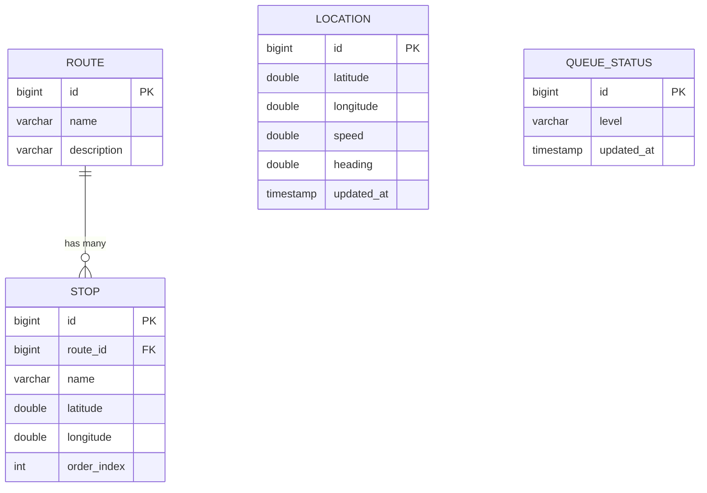

# Database Schema — Uni-Track

> Phase 2 Deliverable | H2 Database Design

---

## 1. Entity-Relationship Diagram



### Design notes:
- **`LOCATION`** and **`QUEUE_STATUS`** are **singleton tables** — they always contain exactly one row that gets upserted. This is intentional: the spec supports only one driver and one queue.
- **`ROUTE`** → **`STOP`** is a one-to-many relationship. Stops are ordered by `order_index`.
- No user table (no auth in MVP).
- No historical location log (each update overwrites).

---

## 2. SQL DDL (schema.sql)

```sql
-- ============================================
-- Uni-Track Database Schema
-- H2 Database (file-based mode)
-- ============================================

-- Route definitions (seeded on startup)
CREATE TABLE IF NOT EXISTS route (
    id          BIGINT AUTO_INCREMENT PRIMARY KEY,
    name        VARCHAR(100)  NOT NULL,
    description VARCHAR(255)
);

-- Ordered stops along each route (seeded on startup)
CREATE TABLE IF NOT EXISTS stop (
    id          BIGINT AUTO_INCREMENT PRIMARY KEY,
    route_id    BIGINT        NOT NULL,
    name        VARCHAR(100)  NOT NULL,
    latitude    DOUBLE        NOT NULL,
    longitude   DOUBLE        NOT NULL,
    order_index INT           NOT NULL,
    CONSTRAINT fk_stop_route FOREIGN KEY (route_id) REFERENCES route(id),
    CONSTRAINT uq_route_order UNIQUE (route_id, order_index)
);

-- Latest driver GPS position (single row, upserted)
CREATE TABLE IF NOT EXISTS location (
    id          BIGINT AUTO_INCREMENT PRIMARY KEY,
    latitude    DOUBLE        NOT NULL,
    longitude   DOUBLE        NOT NULL,
    speed       DOUBLE        DEFAULT 0.0,
    heading     DOUBLE        DEFAULT 0.0,
    updated_at  TIMESTAMP     DEFAULT CURRENT_TIMESTAMP
);

-- Current queue crowd level (single row, upserted)
CREATE TABLE IF NOT EXISTS queue_status (
    id          BIGINT AUTO_INCREMENT PRIMARY KEY,
    level       VARCHAR(20)   NOT NULL DEFAULT 'LOW',
    updated_at  TIMESTAMP     DEFAULT CURRENT_TIMESTAMP
);

-- Index for fast stop ordering per route
CREATE INDEX IF NOT EXISTS idx_stop_route_order ON stop(route_id, order_index);
```

---

## 3. Seed Data (data.sql)

```sql
-- ============================================
-- Uni-Track Seed Data
-- Two routes through UNILAG campus
-- Coordinates: approximate real-world UNILAG positions
-- ============================================

-- ==========================================
-- Route 1: Main Gate → Faculty of Science
-- ==========================================
INSERT INTO route (id, name, description) VALUES
(1, 'Main Gate → Faculty of Science', 'Campus transit corridor from Main Gate Terminal to Faculty of Science via University Road');

-- Stops along Route 1 (ordered)
INSERT INTO stop (route_id, name, latitude, longitude, order_index) VALUES
(1, 'Main Gate',              6.5178, 3.3854, 1),
(1, 'Sports Centre',          6.5165, 3.3935, 2),
(1, 'Faculty of Science',     6.5172, 3.3985, 3);

-- ==========================================
-- Route 2: Main Gate → DLI
-- ==========================================
INSERT INTO route (id, name, description) VALUES
(2, 'Main Gate → DLI', 'Residential corridor from Main Gate to Distance Learning Institute via New Hall');

-- Stops along Route 2 (ordered)
INSERT INTO stop (route_id, name, latitude, longitude, order_index) VALUES
(2, 'Main Gate',              6.5178, 3.3854, 1),
(2, 'New Hall',               6.5200, 3.3926, 2),
(2, 'DLI',                    6.5119, 3.3921, 3);

-- Initialise singleton rows
INSERT INTO location (id, latitude, longitude, speed, heading, updated_at) VALUES
(1, 6.5167, 3.3850, 0.0, 0.0, CURRENT_TIMESTAMP);

INSERT INTO queue_status (id, level, updated_at) VALUES
(1, 'LOW', CURRENT_TIMESTAMP);
```

---

## 4. Table Details

### `route`
| Column | Type | Constraints | Description |
|---|---|---|---|
| `id` | BIGINT | PK, AUTO_INCREMENT | Unique route identifier |
| `name` | VARCHAR(100) | NOT NULL | Display name (e.g., "Main Gate → Faculty of Science") |
| `description` | VARCHAR(255) | nullable | Optional description |

### `stop`
| Column | Type | Constraints | Description |
|---|---|---|---|
| `id` | BIGINT | PK, AUTO_INCREMENT | Unique stop identifier |
| `route_id` | BIGINT | FK → route(id), NOT NULL | Which route this stop belongs to |
| `name` | VARCHAR(100) | NOT NULL | Stop display name |
| `latitude` | DOUBLE | NOT NULL | GPS latitude (decimal degrees) |
| `longitude` | DOUBLE | NOT NULL | GPS longitude (decimal degrees) |
| `order_index` | INT | NOT NULL, UNIQUE per route | Position in route sequence (1, 2, 3...) |

### `location`
| Column | Type | Constraints | Description |
|---|---|---|---|
| `id` | BIGINT | PK, AUTO_INCREMENT | Always 1 (singleton) |
| `latitude` | DOUBLE | NOT NULL | Driver's current latitude |
| `longitude` | DOUBLE | NOT NULL | Driver's current longitude |
| `speed` | DOUBLE | DEFAULT 0.0 | Speed in km/h from GPS |
| `heading` | DOUBLE | DEFAULT 0.0 | Compass heading in degrees (0–360) |
| `updated_at` | TIMESTAMP | DEFAULT CURRENT_TIMESTAMP | Last update time |

### `queue_status`
| Column | Type | Constraints | Description |
|---|---|---|---|
| `id` | BIGINT | PK, AUTO_INCREMENT | Always 1 (singleton) |
| `level` | VARCHAR(20) | NOT NULL, DEFAULT 'LOW' | One of: `LOW`, `MODERATE`, `PACKED` |
| `updated_at` | TIMESTAMP | DEFAULT CURRENT_TIMESTAMP | When the dispatcher last updated |

---

## 5. Singleton Upsert Strategy

Both `location` and `queue_status` use a **single-row upsert** pattern:

```java
// In LocationService.java
public Location updateLocation(LocationDTO dto) {
    Location loc = locationRepository.findById(1L)
        .orElse(new Location());
    loc.setId(1L);
    loc.setLatitude(dto.getLatitude());
    loc.setLongitude(dto.getLongitude());
    loc.setSpeed(dto.getSpeed());
    loc.setHeading(dto.getHeading());
    loc.setUpdatedAt(LocalDateTime.now());
    return locationRepository.save(loc);
}
```

**Why single-row instead of append-only?**
- Spec: one driver. No need for history.
- Simpler queries: `findById(1L)` instead of `findTopByOrderByTimestampDesc()`.
- H2 performance: no table growth, no cleanup needed.
- **Future:** If historical tracking is needed, add a `location_history` table and append there while still upserting the `location` singleton for fast reads.
